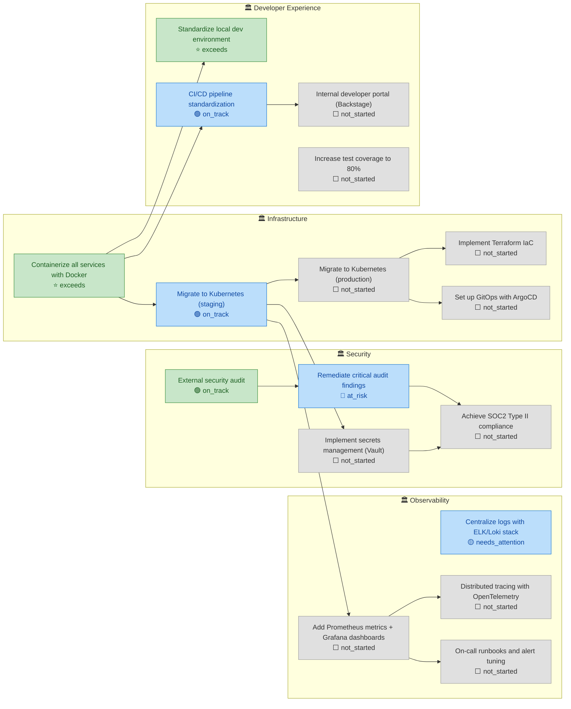

```mermaid
graph LR

  classDef todo fill:#e0e0e0,stroke:#9e9e9e,color:#333333
  classDef wip fill:#bbdefb,stroke:#1976d2,color:#0d47a1
  classDef done fill:#c8e6c9,stroke:#388e3c,color:#1b5e20
  classDef archive fill:#f5f5f5,stroke:#bdbdbd,color:#9e9e9e,opacity:0.6

  subgraph infrastructure["🏛 Infrastructure"]
    infra_001["Containerize all services with Docker<br/>⭐ exceeds"]
    class infra_001 done
    infra_002["Migrate to Kubernetes (staging)<br/>🟢 on_track"]
    class infra_002 wip
    infra_003["Migrate to Kubernetes (production)<br/>⬜ not_started"]
    class infra_003 todo
    infra_004["Implement Terraform IaC<br/>⬜ not_started"]
    class infra_004 todo
    infra_005["Set up GitOps with ArgoCD<br/>⬜ not_started"]
    class infra_005 todo
  end

  subgraph observability["🏛 Observability"]
    obs_001["Centralize logs with ELK/Loki stack<br/>🟡 needs_attention"]
    class obs_001 wip
    obs_002["Add Prometheus metrics + Grafana dashboards<br/>⬜ not_started"]
    class obs_002 todo
    obs_003["Distributed tracing with OpenTelemetry<br/>⬜ not_started"]
    class obs_003 todo
    obs_004["On-call runbooks and alert tuning<br/>⬜ not_started"]
    class obs_004 todo
  end

  subgraph security["🏛 Security"]
    sec_001["External security audit<br/>🟢 on_track"]
    class sec_001 done
    sec_002["Remediate critical audit findings<br/>🔴 at_risk"]
    class sec_002 wip
    sec_003["Implement secrets management (Vault)<br/>⬜ not_started"]
    class sec_003 todo
    sec_004["Achieve SOC2 Type II compliance<br/>⬜ not_started"]
    class sec_004 todo
  end

  subgraph developer_experience["🏛 Developer Experience"]
    devex_001["Standardize local dev environment<br/>⭐ exceeds"]
    class devex_001 done
    devex_002["CI/CD pipeline standardization<br/>🟢 on_track"]
    class devex_002 wip
    devex_003["Internal developer portal (Backstage)<br/>⬜ not_started"]
    class devex_003 todo
    devex_004["Increase test coverage to 80%<br/>⬜ not_started"]
    class devex_004 todo
  end

  infra_001 --> infra_002
  infra_002 --> infra_003
  infra_003 --> infra_004
  infra_003 --> infra_005
  infra_002 --> obs_002
  obs_002 --> obs_003
  obs_002 --> obs_004
  sec_001 --> sec_002
  infra_002 --> sec_003
  sec_002 --> sec_004
  sec_003 --> sec_004
  infra_001 --> devex_001
  infra_001 --> devex_002
  devex_002 --> devex_003
```